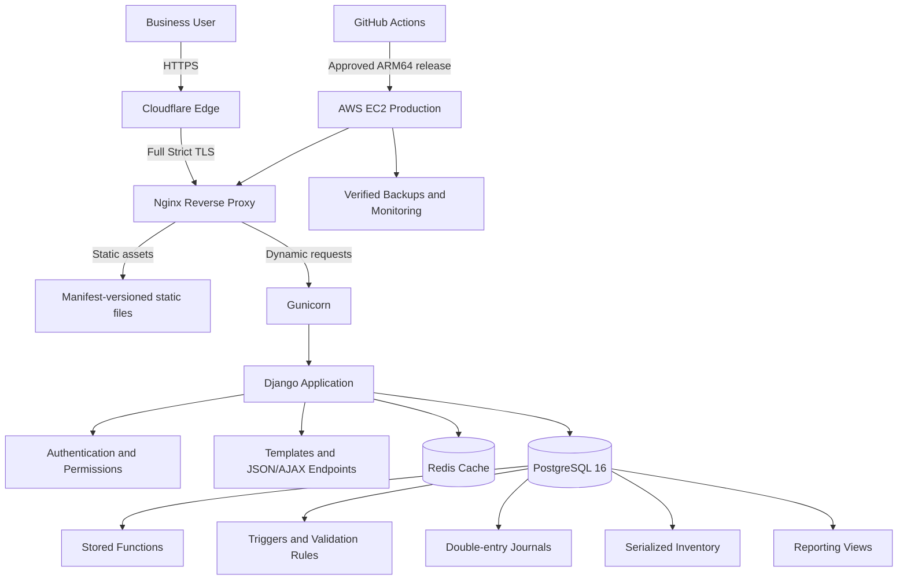
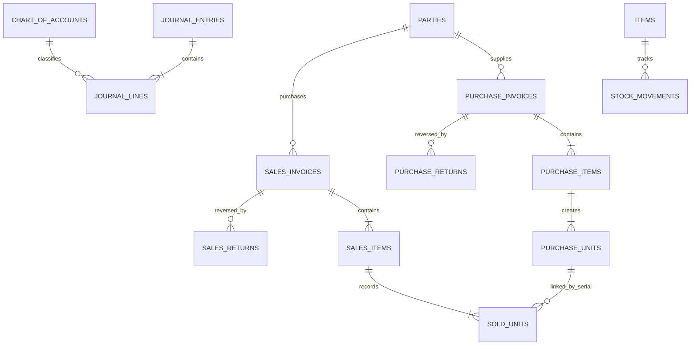
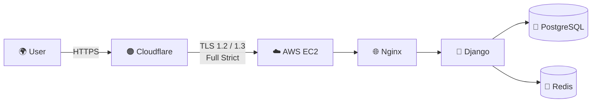
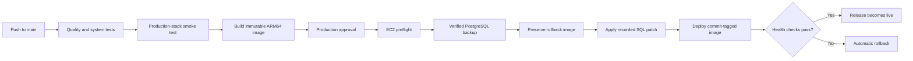

# Accounting Plus Inventory Management System

> A production-deployed accounting and serialized-inventory platform that brings purchasing, sales, stock control, payments, reporting, and double-entry bookkeeping into one secure workspace.

Built and maintained by **Muhammad Maaz Rehan**, Employee at **Swiss Tech Global LLC**.

[](https://www.djangoproject.com/)
[](https://www.postgresql.org/)
[](https://redis.io/)
[](https://docs.docker.com/compose/)
[](https://aws.amazon.com/ec2/)
[](https://www.cloudflare.com/)
[](https://github.com/features/actions)

<p>
  
</p>

## 🎯 Overview

Accounting Plus Inventory Management System is a full-stack business application designed for organizations that need accounting and physical inventory to remain synchronized. Instead of maintaining separate spreadsheets for stock, customer balances, vendor balances, cash flow, and profitability, users can manage the complete transaction lifecycle from a single permission-controlled interface.

The system is live in production on an **AWS EC2 ARM64 instance** and runs as a containerized stack with Nginx, Gunicorn, Django, PostgreSQL, and Redis. The repository also includes automated tests, immutable deployment automation, verified database backups, production monitoring, and automatic application rollback.

This is an actively evolving project. Additional workflow improvements, reporting capabilities, operational hardening, and user-experience updates are planned.

## ✨ How It Helps Users

- 🎯 **One source of truth:** sales, purchases, stock, party balances, cash flow, and journals are updated through coordinated database transactions.
- 📦 **Serialized inventory control:** every physical unit can be tracked by serial number from purchase through sale and return.
- ⚡ **Faster daily operations:** autocomplete, bulk serial entry, invoice navigation, summaries, smart descriptions, and reusable transaction screens reduce repetitive work.
- ⚖️ **Reliable accounting:** double-entry journal posting connects operational activity to ledgers, receivables, payables, cash, income, and company-position reports.
- 🛡️ **Safer corrections:** validated update and delete workflows protect records that are already referenced by later sales or returns.
- 📊 **Clear business insight:** dashboards and reports expose stock levels, inventory value, profit, party balances, aging receivables, expenses, and recent transactions.
- 🔐 **Controlled access:** module-level and action-level permissions let administrators decide who may view, create, update, delete, or report on data.
- 📤 **Exportable information:** business reports can be searched and exported for review or sharing.
- ♻️ **Operational resilience:** health checks, automated backups, monitoring, immutable releases, and rollback safeguards support dependable production use.

## 🧩 Main Capabilities

| Area | Capabilities |
| --- | --- |
| 👥 Parties | Customer, vendor, combined, and expense-party management; opening balances; autocomplete and balance lookup |
| 🏷️ Items | Item catalog, pricing, category/brand details, serialized units, stock lookup, and item history |
| 🛒 Purchases | Create, update, delete, navigate, and summarize purchase invoices with per-unit serial tracking |
| 🧾 Sales | Stock validation, bulk serial lookup, invoice lifecycle management, pricing safeguards, and sale summaries |
| ↩️ Returns | Customer sale returns and vendor purchase returns with stock and accounting reversal rules |
| 💳 Cash flow | Payments, receipts, party balances, date-wise history, and payment-method tracking |
| 🔄 Contra | Party-to-party balance transfers without incorrectly moving the cash account |
| ⚖️ Accounting | Double-entry journals, detailed ledgers, cash ledger, trial balance, receivables, and payables |
| 📈 Reporting | Stock, stock worth, serial ledger, item history, company valuation, sale-wise profit, and monthly statements |
| 📊 Dashboard | Sales KPIs, stock alerts, fast/stale items, top customers/vendors, receivable aging, expenses, and recent activity |
| 🔐 Administration | Session authentication, granular permissions, custom admin interface, and user activity reporting |

## 🏗️ Architecture

The project uses a database-centric architecture. Django is the secure application and presentation layer, while PostgreSQL is also the domain engine: stored functions and triggers enforce the accounting and inventory rules closest to the data.



### 🔁 Request and transaction flow

1. Nginx serves static content directly and proxies application requests to Gunicorn.
2. Django authenticates the user, verifies the required permission, validates the request, and normalizes its payload.
3. Django calls parameterized PostgreSQL functions instead of using domain ORM models.
4. PostgreSQL performs the business transaction, updates stock state, and produces balanced journal entries atomically.
5. Django returns a rendered page or JSON response to the frontend.
6. Redis caches read-heavy dashboard results and cached session reads; transaction screens always use the database as their source of truth.

### 📁 Application modules

```text
financee/          Django settings, root routing, health checks and custom admin
authentication/   Login, logout, current-user endpoint and permission definitions
home/             Dashboard and dashboard APIs
parties/          Customer, vendor and expense-party workflows
items/            Inventory item workflows
purchase/         Purchase invoices and serial intake
sale/             Sales invoices and serialized stock issue
purchaseReturn/   Returns to vendors
saleReturn/       Returns from customers
payments/         Outgoing payments
receipts/         Incoming receipts
contra/           Party-to-party transfers
accountsReports/  Accounting, inventory, profit and monthly reports
templates/        Server-rendered Django templates
static/           JavaScript, CSS and static assets
docker/           Container entrypoint and Nginx configuration
system_tests/     Disposable PostgreSQL business-workflow tests
scripts/          Quality, smoke, monitoring and recovery automation
```

## 🗄️ Database Design

The business schema is intentionally not modeled through Django ORM classes. PostgreSQL is the authoritative source for domain tables, functions, views, constraints, and triggers.

The committed schema fixture contains:

- 29 tables
- 13 reporting and ledger views
- 134 stored functions
- 11 business triggers

Core relationships include:



Important database areas:

- `chartofaccounts`, `journalentries`, and `journallines` implement double-entry accounting.
- `purchaseinvoices`, `purchaseitems`, and `purchaseunits` record purchased serialized inventory.
- `salesinvoices`, `salesitems`, and `soldunits` record inventory sales.
- `purchasereturns`, `salesreturns`, and their line tables implement return lifecycles.
- `payments`, `receipts`, and `contra_entries` post cash-flow and party transactions.
- `stockmovements` maintains inventory movement history.
- Stored functions validate and execute transaction workflows.
- Triggers maintain journal behavior for selected financial records.
- Reporting views and functions power the dashboard and financial reports.

> [!IMPORTANT]
> `db_backup_20260718_0000.sql` is a safe, schema-oriented development and test fixture. It does not contain the live company's business data or credentials. Production dumps are intentionally excluded from Git.

## 🛠️ Technology Stack

| Layer | Technology |
| --- | --- |
| 🐍 Backend | Python 3.12, Django 5.2 |
| 🦄 Application server | Gunicorn |
| 🐘 Database | PostgreSQL 16, PL/pgSQL, JSONB, stored functions, views, and triggers |
| 🔴 Cache and sessions | Redis 7 with Django cached database sessions |
| 🎨 Frontend | Django Templates, HTML5, CSS3, JavaScript, Fetch/AJAX, SweetAlert |
| 🌐 Reverse proxy | Nginx |
| 🐳 Containers | Docker and Docker Compose |
| ☁️ Cloud | AWS EC2 ARM64/Graviton |
| 🟠 Edge and TLS | Cloudflare proxied DNS, Full (strict) TLS, and Cloudflare Origin Certificate |
| 🚀 CI/CD | GitHub Actions with approval-gated production deployment |
| 🧪 Testing | Django TestCase, PostgreSQL system tests, Redis integration tests, coverage, and production-stack smoke tests |
| 🩺 Operations | Readiness checks, scheduled monitoring, verified backups, disaster-recovery drills, and automatic rollback |

Production dependencies are pinned in `requirements.txt`, and Docker base images are digest-pinned for reproducibility.

## 🚀 Production and Delivery

The production application is served through **[swisstechfinance.com](https://swisstechfinance.com/)**. Cloudflare provides the public edge, while an AWS EC2 ARM64/Graviton instance hosts the private Docker application stack.

### 🔒 Cloudflare and origin security



The deployed security boundary is deliberately layered:

- **Cloudflare proxied DNS** keeps the EC2 origin behind the Cloudflare edge.
- **Full (strict) TLS** validates the connection from the visitor to Cloudflare and from Cloudflare to the Nginx origin.
- **Cloudflare Origin Certificate** and its private key are mounted read-only into Nginx.
- **TLS 1.2 and TLS 1.3 only** are enabled at the origin.
- **Cloudflare-only web ingress:** the EC2 security group permits HTTP/HTTPS origin traffic only from Cloudflare's published IP ranges, preventing ordinary clients from bypassing Cloudflare and reaching Nginx directly.
- **Restricted administration:** SSH is separately limited to trusted administrative access.
- **Private data services:** PostgreSQL and Redis have no public host ports and are reachable only inside the Docker network.
- **Secure Django proxy settings:** forwarded HTTPS is trusted only through the configured proxy path, with secure cookies, CSRF origins, HTTPS redirection, and HSTS controlled through production environment variables.

The live AWS deployment contains four isolated services:

| Service | Responsibility |
| --- | --- |
| 🌐 `nginx` | Public entry point, static asset delivery, and reverse proxy |
| 🐍 `web` | Gunicorn and Django application |
| 🐘 `db` | PostgreSQL business data and domain logic |
| 🔴 `redis` | Dashboard caching and cached session reads |

### ⚙️ Complete GitHub Actions CI/CD

Every push to `main` starts a complete, production-aware GitHub Actions pipeline. The same tested application image moves from CI into production; EC2 does not pull source code or rebuild an unverified release.



The automation is organized into three workflows:

| Workflow | Trigger | Responsibility |
| --- | --- | --- |
| 🧪 **CI and deployment** — `.github/workflows/ci.yml` | Every push to `main` or manual dispatch | Test, build, approve, back up, patch, deploy, verify, and roll back |
| 💾 **Database backup** — `.github/workflows/backup.yml` | Daily schedule or manual dispatch | Create a verified custom-format PostgreSQL dump and retain an off-site copy |
| 🩺 **Production monitor** — `.github/workflows/monitor.yml` | Every 30 minutes or manual dispatch | Check EC2, containers, storage, backups, PostgreSQL connectivity, health, and recent errors |

#### 1. Continuous integration

- Builds cached, isolated Docker images for Django tests, PostgreSQL system tests, and production-stack smoke tests.
- Runs the canonical full test suite against disposable PostgreSQL and Redis services.
- Enforces Django system checks, shell/Compose validation, deterministic fixtures, and the branch-coverage threshold.
- Exercises stored functions, triggers, serial-number concurrency, journal balancing, reports, Redis, Gunicorn, Nginx, static assets, and `/health/`.
- Publishes test logs and coverage reports as commit-specific GitHub Actions artifacts.
- Stops immediately when any quality, accounting-integrity, or smoke check fails.

#### 2. Immutable production build

- Builds the production image specifically for `linux/arm64`, matching the AWS Graviton host.
- Tags the image as `financee:<full-git-commit-sha>`—never `latest`.
- Embeds the Git revision in the OCI image metadata.
- Exports a Docker-loadable image archive and records its SHA-256 digest, platform, tag, and commit.
- Uploads the verified archive as a short-retention GitHub Actions artifact for the deployment job.

#### 3. Approval-gated continuous delivery

- Uses a protected GitHub `production` Environment, so deployment waits for explicit approval after CI succeeds.
- Retrieves only the artifact created for the current commit and verifies its checksum, ARM64 architecture, tag, and revision label.
- Connects to EC2 using environment-scoped secrets, a dedicated SSH key, strict host-key checking, and a configured production path.
- Performs a read-only host preflight covering architecture, Docker, Compose, disk space, application configuration, and the existing stack.
- Creates a permission-restricted, commit-specific release directory and transfers only the approved image and deployment files.
- Loads the already-tested image on EC2 and uses `docker-compose.deploy.yml` to disable source builds during deployment.

#### 4. Database and rollback protection

- Creates a custom-format `pg_dump` before any live application change.
- Verifies that the dump is non-empty, readable by `pg_restore`, and protected by a SHA-256 checksum.
- Preserves the currently running web image as `financee:rollback-before-<commit-sha>`.
- Stores rollback metadata—including the previous image ID and revision—in the release directory.
- Applies `production_fixes.sql` transactionally only after the backup and rollback anchor are valid.
- Records the SQL patch checksum, source commit, backup name, and application time in a PostgreSQL deployment ledger, making re-runs idempotent.

#### 5. Health-gated release and automatic rollback

- Recreates only the required `web` and `nginx` services with `--no-build`.
- Confirms that the running container uses the exact approved image ID.
- Waits for Docker health to become healthy and requires Nginx's loopback `/health/` response to equal `{"status": "ok"}`.
- Records the deployed commit atomically when all checks pass.
- Automatically restores the preserved image if startup, container identity, PostgreSQL, Redis, or HTTP readiness fails.
- Keeps the GitHub Actions run failed even after a successful rollback, ensuring a rejected release is never reported as successful.

> [!NOTE]
> Public health probing from shared GitHub-hosted runner IPs is intentionally not used because the production origin accepts web traffic only through Cloudflare. Mandatory release validation runs on EC2 through the trusted loopback path, while scheduled monitoring uses authenticated SSH.

Operational safeguards include:

- PostgreSQL and Redis readiness checks through `/health/`
- non-root application container
- PostgreSQL isolated from public host ports
- commit-specific ARM64 production images
- integrity-checked pre-deployment backups
- transactional SQL patches with a deployment ledger
- preserved previous image before each release
- automatic rollback when startup or HTTP readiness fails
- daily off-site database backups with retention
- scheduled production monitoring
- disposable database-restore and application-rollback drills

## 🐳 Local Setup with Docker

### ✅ Prerequisites

-  Git
-  Docker Engine or Docker Desktop
-  Docker Compose v2

### 1. 📥 Clone the repository

```bash
git clone https://github.com/Maaz-Bin-Haider/Accounting-Plus-Inventory-System.git
cd Accounting-Plus-Inventory-System
```

### 2. ⚙️ Create the environment file

```bash
cp .env.example .env
```

Set secure local values in `.env`:

```env
SECRET_KEY=replace-with-a-long-random-development-key
DEBUG=True
ALLOWED_HOSTS=localhost,127.0.0.1
CSRF_TRUSTED_ORIGINS=http://localhost

DB_NAME=financee
DB_USER=postgres
DB_PASSWORD=replace-with-a-local-password
DB_HOST=db
DB_PORT=5432

REDIS_URL=redis://redis:6379/1
DASHBOARD_CACHE_SECONDS=60
```

Never commit `.env`, database credentials, or production backups.

### 3. 🐘 Start PostgreSQL first

```bash
docker compose up -d db
```

Wait until the database reports healthy:

```bash
docker compose ps
```

### 4. 🗄️ Restore the schema and database logic

```bash
docker compose exec -T db \
  psql -U postgres -d financee -v ON_ERROR_STOP=1 \
  < db_backup_20260718_0000.sql
```

Apply the current stored-procedure hardening patch:

```bash
docker compose exec -T db \
  psql -U postgres -d financee -v ON_ERROR_STOP=1 \
  < production_fixes.sql
```

### 5. 🚀 Start the complete application

```bash
docker compose up -d
docker compose ps
```

Open [http://localhost](http://localhost).

### 6. 🔐 Create an administrator when using the schema-only fixture

```bash
docker compose exec web python manage.py createsuperuser
```

The custom application permissions can then be assigned through Django Admin.

### 🧰 Useful local commands

```bash
# Follow application logs
docker compose logs -f web

# Open PostgreSQL
docker compose exec db psql -U postgres -d financee

# Restart the application service
docker compose restart web

# Stop the stack without deleting database data
docker compose down

# Stop the stack and delete local Docker volumes
docker compose down --volumes
```

> [!CAUTION]
> `docker compose down --volumes` permanently removes the local PostgreSQL volume. Use it only for disposable local environments.

## 🧪 Running the Test Suites

The tests use isolated PostgreSQL and Redis services and are designed not to connect to production.

```bash
# Fast Django suite
scripts/run_fast_tests.sh

# Django, PostgreSQL system, quality and smoke checks
scripts/run_full_tests.sh
```

The current repository artifacts record:

- 143 passing Django tests
- 104 passing PostgreSQL workflow and financial-integrity tests
- production-stack smoke coverage for PostgreSQL, Redis, Gunicorn, Nginx, static assets, and readiness
- 57.4% branch coverage against an enforced 55% minimum

## 🗓️ Development Timeline

The timeline below is derived from the repository's Git history: **247 commits from September 12, 2025 through July 22, 2026**.

```mermaid
flowchart LR
    A["🌱 Sep 2025<br/>Foundation"] --> B["🧾 Oct 2025<br/>Core Workflows"]
    B --> C["🔐 Dec–Mar<br/>Security & Reports"]
    C --> D["✨ Apr–May 2026<br/>Product Expansion"]
    D --> E["📊 Jun 2026<br/>Admin & UX"]
    E --> F["🚀 Jul 2026<br/>AWS & CI/CD"]

    classDef foundation fill:#e8f5e9,stroke:#2e7d32,color:#1b5e20,stroke-width:2px;
    classDef workflow fill:#e3f2fd,stroke:#1976d2,color:#0d47a1,stroke-width:2px;
    classDef security fill:#fff3e0,stroke:#ef6c00,color:#e65100,stroke-width:2px;
    classDef product fill:#f3e5f5,stroke:#8e24aa,color:#4a148c,stroke-width:2px;
    classDef ux fill:#e0f7fa,stroke:#00838f,color:#006064,stroke-width:2px;
    classDef production fill:#fce4ec,stroke:#c2185b,color:#880e4f,stroke-width:2px;

    class A foundation;
    class B workflow;
    class C security;
    class D product;
    class E ux;
    class F production;
```



| Period | Milestone |
| --- | --- |
| Sep 2025 | Project foundation; party, item, payment, receipt, and purchase workflows |
| Oct 2025 | Sales, both return directions, dashboard, navigation, accounting reports, and authentication |
| Dec 2025 | View-only access controls and deployment-oriented static configuration |
| Jan–Mar 2026 | Granular permissions, serial reporting, exports, detailed ledgers, receivables, and payables |
| Apr–May 2026 | Major interface redesigns, bulk serial workflows, invoice exports, monthly reports, and party-balance visibility |
| Jun 2026 | Contra entries, modernized item/party pages, user activity reporting, and richer invoice descriptions |
| Jul 2026 | Smart table descriptions, regression hardening, Dockerization, AWS production delivery, CI/CD, backups, monitoring, and disaster recovery |

## 🔭 Roadmap

Future updates are planned and may include:

- continued accounting and inventory workflow refinement
- expanded management reporting and analytics
- broader automated test coverage
- performance and observability improvements
- additional deployment and security hardening
- continued accessibility and responsive-interface improvements
- improved documentation for operators and contributors

## 👨‍💻 Project Ownership and Usage Rights

This project was designed and developed by:

**Muhammad Maaz Rehan**<br>
Employee, **Swiss Tech Global LLC**

For project inquiries, demonstrations, commercial usage, customization, deployment assistance, or usage-rights discussions, contact:

**Email:** [maaz.rehan2020@gmail.com](mailto:maaz.rehan2020@gmail.com)

No open-source license is currently included in this repository. Cloning the repository for evaluation does not automatically grant commercial, redistribution, or modification rights. Please contact the author for permission and applicable terms.

---

Developed with a focus on traceable inventory, dependable accounting, and production-ready operations.
